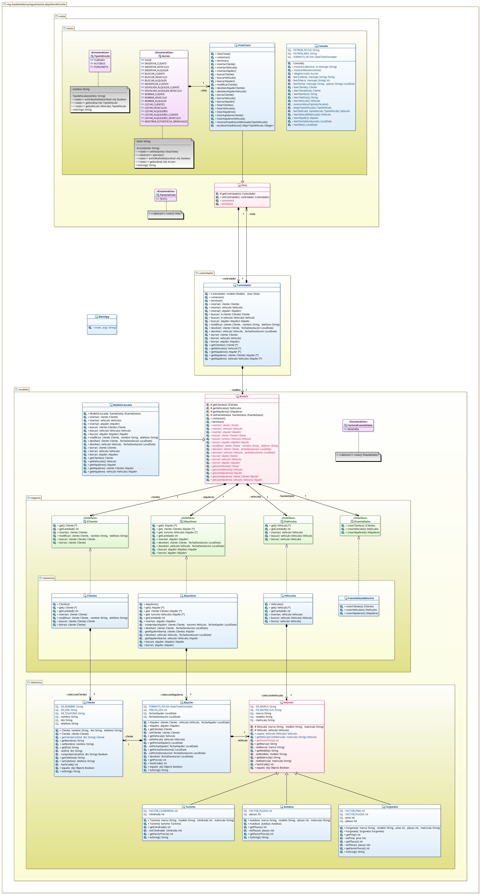

# Tarea: Alquiler de vehículos (v1)
## Profesor: José Ramón Jiménez Reyes
## Alumno: Iván Martínez Estrada

Al cliente le ha gustado bastante la aplicación, pero nos comenta algunas mejoras que necesita la anterior versión y nuevas funcionalidades que le gustaría que tuviese. Todo ello lo abordaremos en este **segundo spring**.

Lo primero que nos comenta el cliente es que a la hora de mostrar los datos del turismo, la cilindrada la expresemos en centímetros cúbicos.

Lo segundo que nos comenta es que la forma en que se realizan las **devoluciones** de  los alquileres no es operativa y que le gustaría poder realizarlas simplemente indicando el **cliente** que la quiere realizar (su DNI) o el **vehículo** que se quiere devolver (su matrícula).

También le gustaría que los **listados** lo hiciesen de forma **ordenada**:

- **Clientes**: ordenados alfabéticamente por nombre y en caso de nombres iguales los ordene por DNI.
- **Vehículos**: ordenados alfabéticamente por marca, modelo y matrícula.
- **Alquileres**: ordenados por fecha de alquiler y por cliente (utilizando el mismo criterio anterior).

Por otra parte nos comenta que no sólo alquila **turismos**, sino que también alquila **autobuses** y **furgonetas**. Para los **autobuses** almacena, además de la marca, modelo y matrícula, el **número de plazas** del mismo. Para las **furgonetas almacena**, además de la marca, modelo y matrícula, el **número de plazas** y el **PMA** (peso máximo autorizado).

El precio que cobra por alquiler de un turismo es el siguiente: **(precioDia + factorPrecio) * numDias**. El **precioDia** es **20**, **numDias** son los días transcurridos entre la **fecha de alquiler** y la de **devolución** y el **factorPrecio** depende del tipo de vehículo alquilado:

- **Turismos**: **cilindrada / factorCilindrada**, donde **factorCilindrada** actualmente es **10**.
- **Autobuses**: **plazas * factorPlazas** , donde **factorPlazas** actualmente es **2**.
- **Furgonetas**: **pma / fatorPma + plazas * factorPlazas**, donde **factorPma** es actualmente **100** y **factorPlazas** es actualmente **1**.

Otra cosa que le gustaría al cliente es que la aplicación ofreciese estadísticas mensuales por el tipo de vehículo.

Tu tarea consiste en realizar una **segunda versión** de la aplicación anterior para que cubra las mejoras pedidas por el cliente y los nuevos requisitos.

Además vamos a aprovechar este **spring** para **refactorizar** lo que llevamos implementado hasta ahora para implementar de una forma adecuada el **patrón Modelo-Vista-Controlador**, ya que preveemos que tendremos varias vistas y varias modelos para nuestra aplicación. Supondremos que en el futuro podremos tener varios modelos y que cada uno de ellos trabaje con una fuente de datos. También supondremos que tendremos varias vistas. Implementaremos el **patrón método de fabrica (Factory Method)** para crear las vistas o los modelos. Para crear las fuentes de datos implementaremos el **patrón fábrica abstracta (Abstract Factory)**. Para el cálculo del precio utilizaremos el **patrón estrategia (Strategy)**.

En este repositorio de GitHub hay un esqueleto de proyecto **gradle** con las dependencias necesarias del proyecto y que ya lleva incluidos todos los test necesarios que el programa debe pasar.

Para ello te muestro un diagrama de clases para el mismo y poco a poco te iré explicando los diferentes pasos a realizar:

#### Primeros Pasos
1. Lo primero que debes hacer es un **fork** del repositorio donde he colocado el esqueleto de este proyecto.
2. Clona tu repositorio remoto recién copiado en GitHub a un repositorio local.
3. Modifica el archivo `README.md` para que incluya tu nombre en el apartado "Alumno".
4. Copia los ficheros del directorio `src/main/java` de tu tarea anterior al repositorio local. Realiza tu **primer commit**.

#### Herencia de vehículos
1. Extrae de la clase `Turismo` la clase `Vehiculo` como se muestra en el diagrama.
2. Haz que el método `equals` utilice la llamada al método `instanceof` correctamente.
3. Declara el método abstracto `getFactorPrecio`.
4. Repasa la clase `Turismo` para que quede como se muestra en el diagrama. Haz uso de `super` siempre que sea posible. Implementa adecuadamente el método `getFactorPrecio` para este vehículo. Haz todos los cambios necesarios para que todo vuelva a funcionar como antes.
5. Implementa la clase `Autobus` como se muestra en el diagrama. Haz uso de `super` siempre que sea posible. Implementa adecuadamente el método `getFactorPrecio` para este vehículo.
6. Implementa la clase `Furgoneta` como se muestra en el diagrama. Haz uso de `super` siempre que sea posible. Implementa adecuadamente el método `getFactorPrecio` para este vehículo.
7. Implementa adecuadamente el método `copiar` de la clase `Vehiculo`.
8. Reimplementa el método `getPrecio` de la clase `Alquiler` para que utilice el `patrón estrategia`.
9. Refactoriza la clase `Turismos` para que pase a llamarse Vehiculos y que utilice siempre la clase `Vehiculo` en vez de `Turismo`.
10. Elimina el anterior método `devolver` de la clase `Alquileres` e implementa los dos nuevos métodos `devolver` para un cliente dado y para un turismo dado tal y como pedía nuestro cliente. Deberás implementar los métodos `getAlquilerAbierto` para un cliente dado y para un turismo dado y que se usarán en los métodos anteriores. Estos métodos deben hacer uso de un iterador y una vez encontremos el alquiler abierto, si es que existe, el método no debe continuar la búsqueda.
11. Comprueba que las **clases pasan los test** y cuando lo hagan realiza un **commit**.

#### Fuentes de datos para el modelo
1. Extrae de cada clase que contiene una colección su interfaz y haz que dicha clase la implemente (utiliza la refactorización para ello) y a su vez que son utilizadas en `Modelo`.
2. Crea la clase `FuenteDatosMemoria` tal y como se indica en el diagrama que será la encargada de implementar el **patrón fábrica abstracta** y que en cada caso creará una de las clases que contiene una colección. Extrae la interfaz de dicha clase.
3. Crea el enumerado `FactoriaFuenteDatos` que implementa el **patrón método de fabricación**, en este caso para la única fuente de datos que es `MEMORIA`.
4. Cambia el nombre de los métodos `getX` tal y como se indica en el diagrama ya que utilizaremos métodos con dicho nombre para obtener acceso a los atributos privados.
5. Convierte la clase `Modelo` en una clase abstracta tal y como se indica en el diagrama y haz que sea implementada por la clase `ModeloCascada`. Debes crear los métodos `getX` para obtener acceso a los atributos privados y que éstos se utilicen para acceder a los mismos.
6. Has los cambios necesarios en `MainApp` para que todo siga funcionando igual.
7. Comprueba que las **clases pasan los test** para la misma y cuando lo haga realiza un **commit**.

#### Vista de texto
1. Modifica la clase `Vista` y `Consola` para se puedan realizar las devoluciones por cliente o por vehículo y no por alquiler.
2. Modifica la clase `Vista` para que los diferentes listados salgan ordenados según los criterios que nos pedía el cliente.
3. Refactoriza el enumerado `Opcion` para que pase a llamarse `Accion` que es un nombre más adecuado. Implementa el método `setVista`. Declara el método abstracto `ejecutar` y haz que sea implementado en cada instancia del enumerado, llamando al método adecuado de la vista.
4. Crea el enumerado `TipoVehiculo` tal y como muestra el diagrama y que modelará el menú para elegir el tipo de vehículo que queremos crear y que también utilizaremos para generar las estadísticas.
5. Modifica la clase `Vista` y la clase `Consola` para que a la hora de insertar podamos elegir el tipo de vehículo y nos permita crear cada uno de los tipos con sus datos necesarios.
6. Implementa el método `mostrarEstadisticasMensualesTipoVehiculo` que utilizará el método `inicializarEstadisticas`. Haz que sea una `Accion` que se pueda ejecutar desde nuestro menú (deberás añadir la instancia a Accion, añadir los métodos en VistaTexto y añadir el método leerMes a Consola).
7. Haz que la clase `Vista` pase a ser abstracta como se indica en el diagrama y que la anterior clase `Vista` pase a llamarse `VistaTexto` y sea la que implemente dicha clase abstracta y tenga la funcionalidad de la anterior.  Debes crear el método `getControlador` y que éste se utilice para acceder al mismo en la clase `VistaTexto`.
8. Haz que `Controlador` utilice dicha clase abstracta.
9. Crea el enumerado `FactoriaVista` que implementará el `patrón método de fabricación`  en este caso para la única vista que tenemos que es `TEXTO`.
10. Modifica la clase `MainApp` para que utilice dicho patrón.
11. Realiza un **commit** y seguidamente un **push** a tu repositorio remoto.

#### Se valorará:

- La indentación debe ser correcta en cada uno de los apartados.
- El nombre de las variables debe ser adecuado.
- Se debe utilizar la clase `Entrada` para realizar la entrada por teclado.
- El programa debe pasar todas las pruebas que van en el esqueleto del proyecto y toda entrada del programa será validada, para evitar que el programa termine abruptamente debido a una excepción. Además, que ni decir tiene, el programa no debe contener ningún error léxico, sintáctico, de dependencias, etc.
- La corrección ortográfica tanto en los comentarios como en los mensajes que se muestren al usuario.
